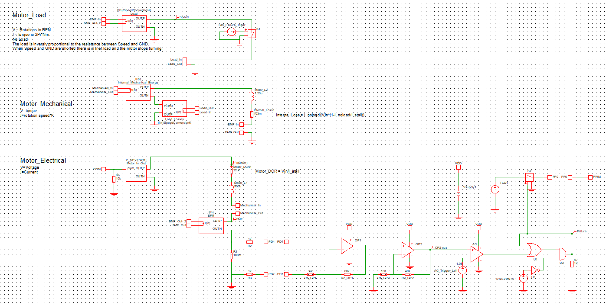

# AVR128DB48 Current Spike Detection Mindi Simulation
A new feature introduced in the AVR® DB family is the Analog Signal Conditioning (OPAMP) peripheral. In this example, the OPAMP is used together with an Analog Comparator (AC) to form a current spike detector. This Mindi simulation simulates the circuit described in the [AN3860 - Overcurrent Protection Using the Integrated Op Amps on AVR DB](https://microchip.com/DS00003860) appnote. The simulation consists of a model of a DC fan, models of the AVR DB Op Amps and generic components representing the rest of the functionality of the AVR DB.

## Related Documentation

* [AN3860 - Overcurrent Protection Using the Integrated Op Amps on AVR DB](https://microchip.com/DS00003860) 
* [AVR128DB48 device page](https://www.microchip.com/wwwproducts/en/AVR128DB48)
* [AVR128DB48 Curiosity Nano User Guide](https://www.microchip.com/DS50003037)

## Related Software
* [AVR128DB48 Current Spike Detection Code Examples](https://github.com/search?q=topic%3Aavr-db+topic%3Aovercurrent-protection+org%3Amicrochip-pic-avr-examples)

### Mindi Simulation

Download and open the **Mindi schematic [here](https://github.com/microchip-pic-avr-examples/avr128db48-current-protection-mindi/releases/latest)**

Press the _play_ button to simulate with an example stimulus source.

### Tweaking
There are several parameters that can be changed so the DC model:
* Motor_DCR1 is the internal resistance of the DC motor
* Motor_L1 is the internal inductance of the DC motor
* Internal_Loss1 is the mechanical losses of the motor
* Motr_L2 is the inertia of the motor
* SpeedConversionK is the electromotive force constant or the motor torque constant

There are several application specific parameters: 
* The gain of the Op Amps can be changed by changing the relationship between R4 and R5 and between R6 and R7
* The AC trigger level by changing AC_Trigger_Lvl1 

### Don't have Mindi?
You can download and install the [Mindi simulation tool](https://www.microchip.com/mplab/mplab-mindi), or use another SPICE simulator of your own preference. For use with different simulators, a plain spice model can be found in "Opamp_AVR_DB.txt" to replace the mindi-optimized ".lb" 